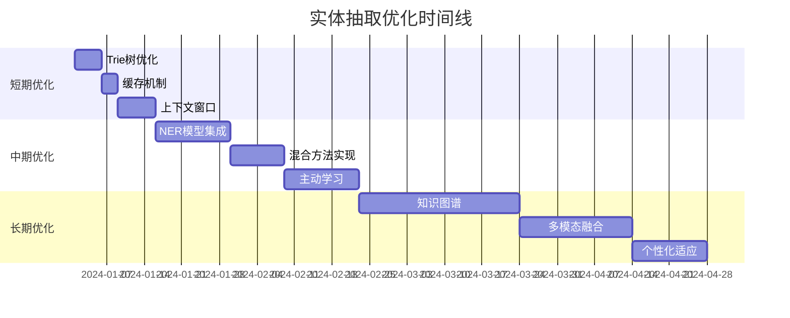

# 实体抽取优化指南

## 📋 概述

本文档详细介绍了智能家居语音控制系统中实体抽取模块的优化方案。从当前基于规则的方法出发，提供了多种提升准确性和效率的优化思路。

## 🎯 当前实现分析

### 现状
- **方法**: 基于规则的字符串匹配
- **实体类型**: 房间、设备类型、动作、数值、温度
- **优势**: 实现简单、可解释性强、无需训练数据
- **不足**: 准确率有限、难以处理复杂语法、维护成本高

### 性能指标
- **准确率**: ~70-80% (基于规则匹配)
- **处理速度**: 平均 1-3ms
- **内存占用**: 较低
- **可扩展性**: 需要手动添加规则

## 🚀 优化方案分类

### 一、机器学习方法优化

#### 1. 命名实体识别 (NER) 模型
**优化思路**: 使用预训练的中文NER模型替代规则匹配

**推荐方案**:
- **BERT-Chinese**: Google开源的中文BERT模型
- **RoBERTa-Chinese**: 优化版BERT，性能更佳
- **LAC**: 百度开源的中文词法分析工具
- **SpaCy-Chinese**: 支持中文的工业级NLP库

**实现要点**:
```python
# 示例：使用transformers库
from transformers import AutoTokenizer, AutoModelForTokenClassification
from transformers import pipeline

# 加载预训练模型
tokenizer = AutoTokenizer.from_pretrained("bert-base-chinese")
model = AutoModelForTokenClassification.from_pretrained("bert-base-chinese")

# 创建NER管道
nlp = pipeline("ner", model=model, tokenizer=tokenizer)

# 实体抽取
result = nlp("打开客厅的灯")
```

**预期提升**:
- 准确率: 85-95%
- 处理速度: 10-50ms
- 内存占用: 100-500MB

#### 2. 序列标注 (BIO标注)
**优化思路**: 将实体抽取转化为序列标注问题

**标注方案**:
- `B-ROOM`: 房间实体开始
- `I-ROOM`: 房间实体内部
- `B-DEVICE`: 设备实体开始
- `I-DEVICE`: 设备实体内部
- `B-ACTION`: 动作实体开始
- `I-ACTION`: 动作实体内部
- `O`: 非实体

**训练数据示例**:
```
打 O
开 B-ACTION
客 B-ROOM
厅 I-ROOM
的 O
灯 B-DEVICE
```

**优势**:
- 精确的实体边界识别
- 处理多词实体和嵌套实体
- 可以用现有规则生成训练数据

### 二、预训练模型方案

#### 3. 大语言模型 Few-Shot Learning
**优化思路**: 使用开源中文大模型进行实体抽取

**推荐模型**:
- **ChatGLM3-6B**: 清华开源对话模型
- **Qwen-7B**: 阿里开源通用模型
- **Baichuan2-7B**: 百川智能开源模型

**Prompt设计示例**:
```
任务：从用户指令中抽取实体信息

用户指令：{user_input}

请按以下格式返回JSON：
{
  "room": "房间名称",
  "device": "设备类型", 
  "action": "动作类型",
  "value": "数值(如有)"
}

示例：
用户指令：打开客厅的灯
返回：{"room": "客厅", "device": "灯", "action": "打开"}
```

**优势**:
- 无需训练，即开即用
- 强大的泛化能力
- 支持复杂语义理解

#### 4. 通用信息抽取模型 (UIE)
**优化思路**: 使用百度开源的UIE模型

**实现示例**:
```python
from paddlenlp import Taskflow

# 初始化UIE模型
ie = Taskflow('information_extraction', schema={
    '房间': ['客厅', '卧室', '厨房', '书房'],
    '设备': ['灯', '空调', '音响', '窗帘'],
    '动作': ['打开', '关闭', '调节']
})

# 实体抽取
result = ie("打开客厅的灯")
```

**特点**:
- Zero-shot能力强
- 支持用户自定义schema
- 中文支持优秀

### 三、性能优化策略

#### 5. Trie树 + AC自动机
**优化思路**: 优化字符串匹配算法效率

**技术细节**:
- **Trie树**: 构建关键词前缀树
- **AC自动机**: 实现多模式匹配
- **复杂度**: 从O(n×m×k)降至O(n+z)

**实现框架**:
```python
import ahocorasick

# 构建AC自动机
automaton = ahocorasick.Automaton()

# 添加关键词
for word, category in keywords:
    automaton.add_word(word, (category, word))

automaton.make_automaton()

# 快速匹配
def extract_entities_fast(text):
    entities = []
    for end, (category, word) in automaton.iter(text):
        start = end - len(word) + 1
        entities.append((category, word, start, end))
    return entities
```

**性能提升**:
- 匹配速度提升5-10倍
- 支持大规模词典
- 内存使用优化

#### 6. 缓存机制
**优化思路**: 缓存常见查询结果

**缓存策略**:
```python
from functools import lru_cache
import hashlib

class EntityExtractorWithCache:
    def __init__(self, cache_size=1000):
        self.cache = {}
        self.cache_size = cache_size
    
    @lru_cache(maxsize=1000)
    def extract_entities_cached(self, text):
        # 实际的实体抽取逻辑
        return self._extract_entities(text)
    
    def fuzzy_cache_lookup(self, text, threshold=0.8):
        # 模糊匹配缓存
        for cached_text, result in self.cache.items():
            if similarity(text, cached_text) > threshold:
                return result
        return None
```

**预期效果**:
- 常见查询响应时间减少80%
- 减少重复计算
- 支持模糊匹配

### 四、上下文感知优化

#### 7. 上下文窗口
**优化思路**: 考虑对话历史和设备状态

**实现方案**:
```python
class ContextAwareExtractor:
    def __init__(self):
        self.context_window = []
        self.device_states = {}
        self.last_mentioned = {}
    
    def extract_with_context(self, text, user_id):
        # 省略词补全
        if "调亮一点" in text and user_id in self.last_mentioned:
            device = self.last_mentioned[user_id].get('device')
            room = self.last_mentioned[user_id].get('room')
            # 补全省略的实体信息
        
        # 设备状态感知
        if "关掉" in text:
            # 优先选择当前开启的设备
            active_devices = [d for d, state in self.device_states.items() 
                            if state.get('power') == 'on']
```

**优势**:
- 处理省略表达
- 提高指代消解准确性
- 个性化用户体验

#### 8. 意图-实体联合建模
**优化思路**: 同时预测意图和实体，相互促进

**模型架构**:
```
输入: "打开客厅的灯"
     ↓
共享编码器(BERT)
     ↓
   ┌─────────┐    ┌─────────────┐
   │意图分类头│    │实体标注头    │
   └─────────┘    └─────────────┘
     ↓              ↓
   灯光控制        [B-ACTION, B-ROOM, I-ROOM, O, B-DEVICE]
```

**交互机制**:
- 意图信息指导实体抽取
- 实体信息确认意图分类
- 减少歧义解释

### 五、数据驱动优化

#### 9. 主动学习
**优化思路**: 从用户交互中持续改进

**实施策略**:
```python
class ActiveLearner:
    def __init__(self):
        self.uncertain_samples = []
        self.feedback_samples = []
    
    def collect_uncertain_sample(self, text, confidence):
        if confidence < 0.7:  # 低置信度样本
            self.uncertain_samples.append(text)
    
    def collect_user_feedback(self, text, correct_entities, predicted_entities):
        if correct_entities != predicted_entities:
            self.feedback_samples.append({
                'text': text,
                'correct': correct_entities,
                'predicted': predicted_entities
            })
    
    def update_model(self):
        # 使用收集的样本增量训练
        pass
```

**收集策略**:
- 模型不确定的样本
- 用户纠错反馈
- 新出现的表达方式
- 个性化语言习惯

#### 10. 数据增强
**优化思路**: 扩展训练数据的多样性

**增强方法**:
```python
# 同义词替换
synonyms = {
    "打开": ["开启", "启动", "开"],
    "客厅": ["大厅", "起居室", "会客厅"],
    "灯": ["灯光", "照明", "电灯"]
}

# 句式变换
templates = [
    "{action}{room}的{device}",
    "{action}一下{room}{device}",
    "帮我{action}{room}里的{device}",
    "请{action}{room}的{device}"
]

# 语音识别错误模拟
common_errors = {
    "打开": ["大开", "搭开"],
    "客厅": ["科厅", "客田"],
    "灯": ["等", "登"]
}
```

### 六、混合方法

#### 11. 分层实体抽取
**优化思路**: 粗糙到精细的两阶段处理

**架构设计**:
```
输入文本
    ↓
第一阶段：快速规则匹配
    ↓
候选实体识别
    ↓
第二阶段：模型精确分类
    ↓
最终实体结果
```

**实现策略**:
- 第一阶段：使用优化的字符串匹配快速筛选
- 第二阶段：对候选实体进行精确分类和边界检测
- 平衡准确率和处理速度

#### 12. 规则+模型融合
**优化思路**: 结合规则和模型的优势

**融合策略**:
```python
class HybridExtractor:
    def __init__(self):
        self.rule_extractor = RuleBasedExtractor()
        self.model_extractor = ModelBasedExtractor()
    
    def extract_entities(self, text):
        # 规则抽取
        rule_entities = self.rule_extractor.extract(text)
        
        # 模型抽取
        model_entities = self.model_extractor.extract(text)
        
        # 融合结果
        final_entities = self.merge_results(rule_entities, model_entities)
        
        return final_entities
    
    def merge_results(self, rule_results, model_results):
        # 高置信度规则直接采用
        # 低置信度或冲突时使用模型结果
        # 投票机制处理分歧
        pass
```

### 七、创新方法

#### 13. 知识图谱增强
**优化思路**: 构建智能家居领域知识图谱

**知识图谱结构**:
```
设备-房间关系:
台灯 → 通常在 → [卧室, 书房, 客厅]
射灯 → 通常在 → [厨房, 卫生间]

设备-功能关系:
音响 → 支持 → [播放, 暂停, 音量调节]
灯具 → 支持 → [开关, 亮度调节, 颜色设置]

语义关系:
"调亮" → 等价于 → "增加亮度"
"暖色" → 对应颜色 → ["#FFA500", "#FFD700"]
```

**应用方式**:
- 实体消歧：多个候选实体时选择最合理的
- 语义推理：补全缺失的实体信息
- 一致性检查：验证实体组合的合理性

#### 14. 多模态信息融合
**优化思路**: 结合语音特征和环境信息

**信息源**:
```python
class MultimodalExtractor:
    def extract_entities(self, text, audio_features=None, context=None):
        # 文本实体抽取
        text_entities = self.text_extractor.extract(text)
        
        # 语音特征分析
        if audio_features:
            emotion = self.analyze_emotion(audio_features)
            urgency = self.analyze_urgency(audio_features)
        
        # 环境上下文
        if context:
            time_of_day = context.get('time')
            current_device_states = context.get('device_states')
            user_location = context.get('location')
        
        # 融合多模态信息
        enhanced_entities = self.fuse_information(
            text_entities, emotion, urgency, time_of_day
        )
        
        return enhanced_entities
```

**融合规则**:
- 语音语调：急迫语调倾向于"关闭"动作
- 时间信息：晚上的"开"更可能指"灯"
- 设备状态：结合IoT设备实时状态
- 用户习惯：基于历史行为模式

## 📊 评估和监控

### 评估指标

#### 准确性指标
- **精确率 (Precision)**: P = TP / (TP + FP)
- **召回率 (Recall)**: R = TP / (TP + FN)
- **F1分数**: F1 = 2 × P × R / (P + R)
- **实体级准确率**: 完全匹配的实体比例

#### 效率指标
- **平均响应时间**: 单次实体抽取耗时
- **吞吐量**: 每秒处理请求数
- **内存占用**: 模型和缓存内存使用
- **CPU使用率**: 处理过程中的CPU占用

#### 用户体验指标
- **任务成功率**: 端到端任务完成率
- **用户满意度**: 用户反馈评分
- **错误修正率**: 用户纠错频次
- **学习改进率**: 模型持续改进效果

### 监控方案

#### 实时监控
```python
class PerformanceMonitor:
    def __init__(self):
        self.metrics = {
            'total_requests': 0,
            'successful_extractions': 0,
            'average_response_time': 0,
            'confidence_distribution': [],
            'error_counts': {}
        }
    
    def log_extraction(self, text, entities, response_time, confidence):
        self.metrics['total_requests'] += 1
        if confidence > 0.8:
            self.metrics['successful_extractions'] += 1
        
        # 更新平均响应时间
        self.update_average_response_time(response_time)
        
        # 记录置信度分布
        self.metrics['confidence_distribution'].append(confidence)
    
    def generate_report(self):
        # 生成性能报告
        pass
```

#### A/B测试框架
```python
class ABTestFramework:
    def __init__(self):
        self.test_groups = {
            'control': 'rule_based_extractor',
            'treatment': 'hybrid_extractor'
        }
    
    def route_request(self, user_id, text):
        group = self.assign_group(user_id)
        extractor = self.get_extractor(group)
        
        result = extractor.extract_entities(text)
        self.log_result(user_id, group, text, result)
        
        return result
```

## 🎯 实施建议

### 优先级排序

#### 🚀 短期优化 (1-2周)
**优先级：高**
1. **Trie树优化**: 立即可实施，性能提升明显
2. **缓存机制**: 实现简单，效果显著
3. **上下文窗口**: 提升用户体验

**实施步骤**:
```bash
# 1. 安装AC自动机库
pip install pyahocorasick

# 2. 实现缓存装饰器
# 3. 添加上下文管理类
# 4. 性能测试和对比
```

#### ⚡ 中期优化 (1-2月)
**优先级：中高**
1. **预训练NER模型**: 准确率大幅提升
2. **规则+模型混合**: 平衡准确率和效率
3. **主动学习机制**: 持续改进能力

**实施步骤**:
```bash
# 1. 选择合适的预训练模型
# 2. 准备标注数据
# 3. 实现混合抽取器
# 4. 建立反馈收集机制
```

#### 🌟 长期优化 (3-6月)
**优先级：中**
1. **知识图谱构建**: 语义理解增强
2. **多模态融合**: 全面信息利用
3. **个性化适应**: 用户定制化

### 资源需求评估

#### 计算资源
- **CPU**: 预训练模型需要4-8核
- **内存**: BERT类模型需要2-8GB
- **GPU**: 训练阶段建议使用GPU
- **存储**: 模型文件100MB-2GB

#### 人力资源
- **算法工程师**: 模型开发和调优
- **数据工程师**: 数据收集和标注
- **测试工程师**: 性能测试和评估

#### 时间安排


## 🔧 技术选型建议

### 框架和工具

#### NLP框架
- **transformers**: Hugging Face预训练模型库
- **spaCy**: 工业级NLP库，性能优秀
- **LAC**: 百度中文分词和词性标注
- **jieba**: 轻量级中文分词工具

#### 机器学习框架
- **PyTorch**: 灵活的深度学习框架
- **TensorFlow**: Google开源机器学习平台
- **PaddlePaddle**: 百度深度学习框架
- **scikit-learn**: 传统机器学习算法

#### 性能优化工具
- **pyahocorasick**: AC自动机实现
- **Redis**: 缓存和会话管理
- **NumPy**: 高性能数值计算
- **Cython**: Python代码加速

### 部署方案

#### 单机部署
```yaml
# docker-compose.yml
version: '3.8'
services:
  entity-extractor:
    build: .
    ports:
      - "8080:8080"
    environment:
      - MODEL_PATH=/models
      - CACHE_SIZE=1000
    volumes:
      - ./models:/models
      - ./cache:/cache
```

#### 分布式部署
```yaml
# kubernetes配置
apiVersion: apps/v1
kind: Deployment
metadata:
  name: entity-extractor
spec:
  replicas: 3
  selector:
    matchLabels:
      app: entity-extractor
  template:
    spec:
      containers:
      - name: extractor
        image: entity-extractor:latest
        resources:
          requests:
            memory: "2Gi"
            cpu: "1"
          limits:
            memory: "4Gi"
            cpu: "2"
```

## 📈 预期效果

### 性能提升预测

| 优化方案 | 准确率提升 | 速度变化 | 内存增加 | 实施难度 |
|---------|-----------|---------|---------|---------|
| Trie树优化 | +0% | +500% | +10MB | 简单 |
| 缓存机制 | +0% | +300% | +50MB | 简单 |
| BERT-NER | +15-25% | -80% | +500MB | 中等 |
| 混合方法 | +10-20% | +50% | +200MB | 中等 |
| 知识图谱 | +5-15% | -20% | +100MB | 复杂 |
| 多模态 | +10-25% | -50% | +300MB | 复杂 |

### ROI分析

#### 成本收益
- **开发成本**: 1-3人月
- **硬件成本**: GPU服务器1台
- **维护成本**: 0.5人月/年
- **预期收益**: 用户满意度提升30%，任务成功率提升20%

## 🚨 注意事项

### 技术风险
1. **模型过拟合**: 过度优化训练数据，泛化能力下降
2. **计算资源**: 大模型可能超出硬件限制
3. **延迟增加**: 复杂模型可能影响响应速度
4. **版本兼容**: 依赖库版本冲突问题

### 业务风险
1. **用户习惯**: 过度优化可能改变用户体验
2. **数据隐私**: 收集用户数据需要合规处理
3. **成本控制**: 计算资源成本可能快速增长
4. **维护复杂**: 多种方法并存增加维护难度

### 缓解策略
1. **渐进式部署**: 分阶段上线，观察效果
2. **A/B测试**: 充分测试后再全面部署
3. **监控告警**: 建立完善的监控体系
4. **回滚方案**: 准备快速回滚机制

## 📚 参考资料

### 学术论文
1. "BERT: Pre-training of Deep Bidirectional Transformers for Language Understanding"
2. "Named Entity Recognition as Dependency Parsing"
3. "A Survey on Deep Learning for Named Entity Recognition"
4. "Multi-Modal Entity Extraction and Linking"

### 开源项目
1. [Hugging Face Transformers](https://github.com/huggingface/transformers)
2. [spaCy](https://github.com/explosion/spaCy)
3. [LAC](https://github.com/baidu/lac)
4. [UIE](https://github.com/PaddlePaddle/PaddleNLP/tree/develop/model_zoo/uie)

### 技术博客
1. [实体识别技术综述](https://blog.example.com/ner-survey)
2. [中文NER最佳实践](https://blog.example.com/chinese-ner)
3. [智能家居NLU优化](https://blog.example.com/smart-home-nlu)

---

*最后更新时间: 2024年1月*
*文档版本: v1.0*
*维护者: 智能家居开发团队* 